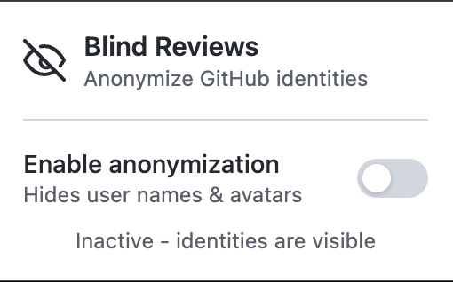

# GitHub Blind Reviews Extension


It anonymizes GitHub identities (authors, commenters, and reviewers) to reduce bias during reviews.
The toolbar icon changes by state: ON uses a blindfolded, OFF does not.




## Install

- [Chrome Web Store](https://chromewebstore.google.com/detail/inoocdpeofplhbjpdkcacaenaionganf)
- [Firefox Add-ons](https://addons.mozilla.org/en-US/firefox/addon/github-blind-reviews/)

## Tech

This project uses [WXT](https://wxt.dev/) to build a multi-browser WebExtension
for Chrome, Firefox (MV3), and Edge.

## Setup

```bash
npm install
```

## Development

```bash
npm run dev:chrome
npm run dev:firefox
npm run dev:edge
```

## Production Builds

```bash
npm run build:chrome
npm run build:firefox
npm run build:edge
```

## Zip Packages

```bash
npm run zip:chrome
npm run zip:firefox
npm run zip:edge
```

Packages are generated in `.output/`.

## Quality Checks

```bash
npm run typecheck
npm run lint
npm run format:check
npm run test
```
